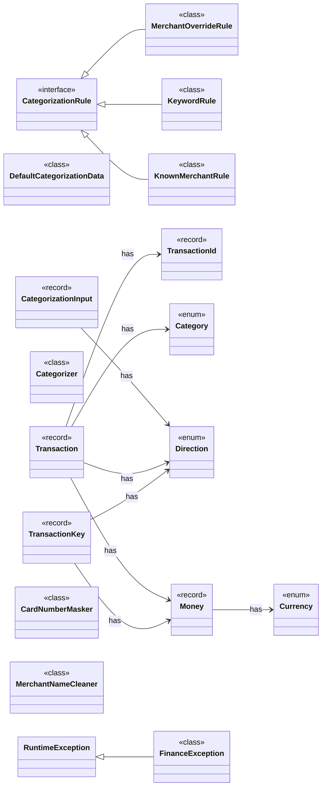
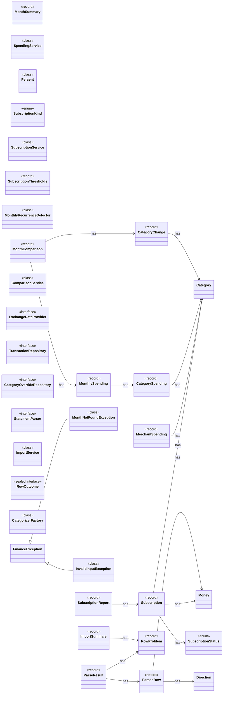
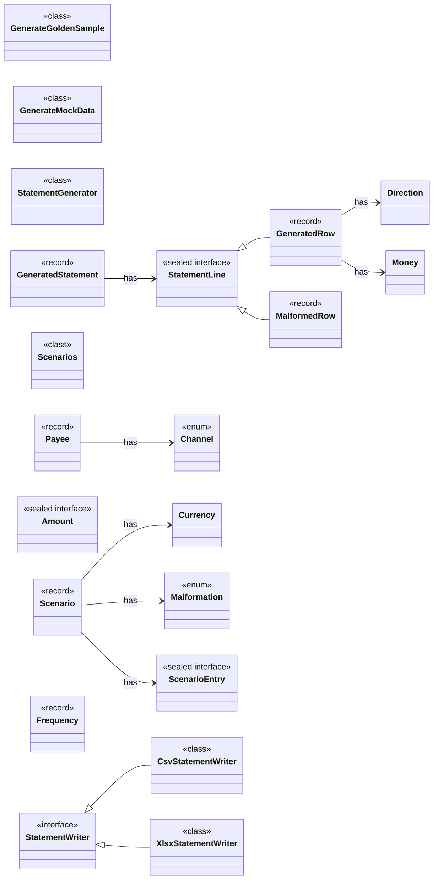
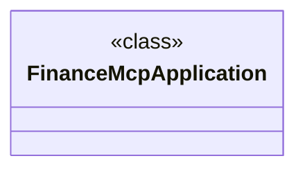

# Type landscape

_Generated by graphify — do not edit by hand. Regenerate:_ `bash .claude/skills/graphify/graphify.sh generate`

## domain

```mermaid
classDiagram
    direction LR
    class MerchantOverrideRule { <<class>> }
    class CategorizationInput { <<record>> }
    class KeywordRule { <<class>> }
    class DefaultCategorizationData { <<class>> }
    class KnownMerchantRule { <<class>> }
    class CategorizationRule { <<interface>> }
    class Categorizer { <<class>> }
    class TransactionId { <<record>> }
    class TransactionKey { <<record>> }
    class Category { <<enum>> }
    class Direction { <<enum>> }
    class Transaction { <<record>> }
    class Money { <<record>> }
    class Currency { <<enum>> }
    class FinanceException { <<class>> }
    class CardNumberMasker { <<class>> }
    class MerchantNameCleaner { <<class>> }
    CategorizationInput --> Direction : has
    CategorizationRule <|-- KeywordRule
    CategorizationRule <|-- KnownMerchantRule
    CategorizationRule <|-- MerchantOverrideRule
    Money --> Currency : has
    RuntimeException <|-- FinanceException
    Transaction --> Category : has
    Transaction --> Direction : has
    Transaction --> Money : has
    Transaction --> TransactionId : has
    TransactionKey --> Direction : has
    TransactionKey --> Money : has
```

## application

```mermaid
classDiagram
    direction LR
    class MonthlySpending { <<record>> }
    class MonthSummary { <<record>> }
    class SpendingService { <<class>> }
    class MerchantSpending { <<record>> }
    class CategorySpending { <<record>> }
    class Percent { <<class>> }
    class SubscriptionStatus { <<enum>> }
    class SubscriptionKind { <<enum>> }
    class SubscriptionReport { <<record>> }
    class SubscriptionService { <<class>> }
    class Subscription { <<record>> }
    class SubscriptionThresholds { <<record>> }
    class MonthlyRecurrenceDetector { <<class>> }
    class CategoryChange { <<record>> }
    class MonthComparison { <<record>> }
    class ComparisonService { <<class>> }
    class ExchangeRateProvider { <<interface>> }
    class TransactionRepository { <<interface>> }
    class CategoryOverrideRepository { <<interface>> }
    class StatementParser { <<interface>> }
    class MonthNotFoundException { <<class>> }
    class InvalidInputException { <<class>> }
    class ImportService { <<class>> }
    class ImportSummary { <<record>> }
    class RowOutcome { <<sealed interface>> }
    class RowProblem { <<record>> }
    class CategorizerFactory { <<class>> }
    class ParseResult { <<record>> }
    class ParsedRow { <<record>> }
    CategoryChange --> Category : has
    CategorySpending --> Category : has
    FinanceException <|-- InvalidInputException
    FinanceException <|-- MonthNotFoundException
    ImportSummary --> RowProblem : has
    MerchantSpending --> Category : has
    MonthComparison --> CategoryChange : has
    MonthComparison --> MonthlySpending : has
    MonthlySpending --> CategorySpending : has
    ParseResult --> ParsedRow : has
    ParseResult --> RowProblem : has
    ParsedRow --> Direction : has
    ParsedRow --> Money : has
    Subscription --> Category : has
    Subscription --> Money : has
    Subscription --> SubscriptionStatus : has
    SubscriptionReport --> Subscription : has
```

## mockdata

```mermaid
classDiagram
    direction LR
    class GenerateGoldenSample { <<class>> }
    class GenerateMockData { <<class>> }
    class GeneratedRow { <<record>> }
    class MalformedRow { <<record>> }
    class StatementLine { <<sealed interface>> }
    class StatementGenerator { <<class>> }
    class GeneratedStatement { <<record>> }
    class ScenarioEntry { <<sealed interface>> }
    class Scenarios { <<class>> }
    class Scenario { <<record>> }
    class Amount { <<sealed interface>> }
    class Channel { <<enum>> }
    class Payee { <<record>> }
    class Frequency { <<record>> }
    class Malformation { <<enum>> }
    class CsvStatementWriter { <<class>> }
    class StatementWriter { <<interface>> }
    class XlsxStatementWriter { <<class>> }
    GeneratedRow --> Direction : has
    GeneratedRow --> Money : has
    GeneratedStatement --> StatementLine : has
    Payee --> Channel : has
    Scenario --> Currency : has
    Scenario --> Malformation : has
    Scenario --> ScenarioEntry : has
    StatementLine <|-- GeneratedRow
    StatementLine <|-- MalformedRow
    StatementWriter <|-- CsvStatementWriter
    StatementWriter <|-- XlsxStatementWriter
```

## mcp

```mermaid
classDiagram
    direction LR
    class FinanceMcpApplication { <<class>> }
```
